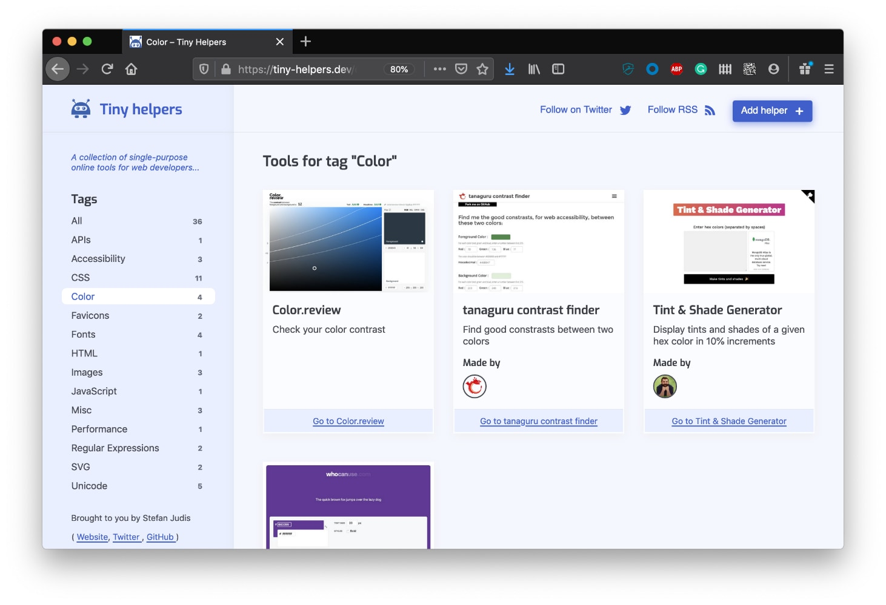

# smart-village.dev

[smart-village.dev](https://smart-village.dev/)

> A collection of useful digitalization projects.



## Contributing

### requirements
* Node: `v18`


**Additionally, please have a look at the [CONTRIBUTING.md](./CONTRIBUTING.md) including further information.**

### 1. Setup
Fork and clone this repository. Head over to your terminal and run the following command:

```
git clone git@github.com:[YOUR_USERNAME]/smart-village.dev.git
cd smart-village.dev
npm ci
npm run helper:add
```

### 2. Add a new helper

* as JSON by npm script: `npm run helper:add` will ask a few questions and create a file in `helpers/`.
* as Markdown: Create a new file in `helpers/` and follow the structure of the existing files.


Commit the changes and [open a pull request](https://help.github.com/en/github/collaborating-with-issues-and-pull-requests/creating-a-pull-request).

### 3. Run the project locally

This project uses Vercel's routing configuration. The `/` route doesn't work locally. To start, navigate to `localhost:8080/home/` after running `npm run dev`.

```
npm run dev
```


## Behind the scenes
* data is taking as .md or .json from `helpers/` and transformed into a JSON object by `getHelpers()` from `lib/helpers.js`
* Screenshots are taking with headles puppeteer and saved in `_site_/screenshots/` with the same name as the helper.
* user images from github are accessed by the username from `api/user-image.js` or taking full image path
* templates can be found in `site/_includes/`

## Contributors :sparkles:
<table>
    <!-- Only 10 <td> (cell) per <tr> (row) please -->
    <tr>
        <td align="center">
            <a href="https://github.com/willi84">
                
                <br />
                <sub><b>Robert Willemelis</b></sub>
            </a>
        </td>
    </tr>
</table>

## Licenses

| License | Description | Link |
| --- | --- | --- |
| MIT | Terminal | [Wikimedia/Github](https://en.m.wikipedia.org/wiki/File:Octicons-terminal.svg) |
| GNU | Laptop | [Wikimedia/Daniel Clemente](https://de.m.wikipedia.org/wiki/Datei:Laptop_icon.svg) |
